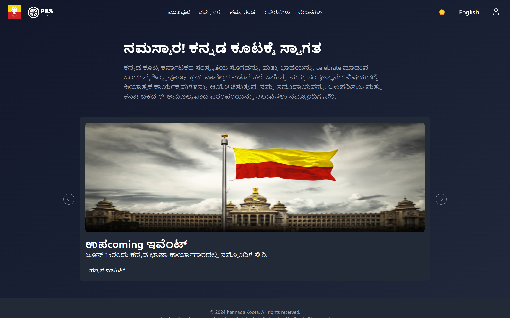
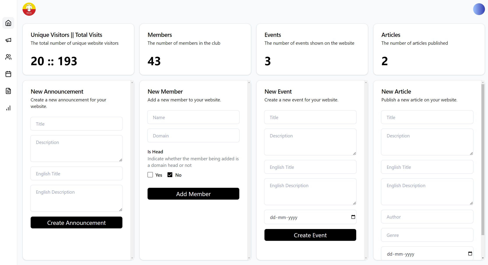

# 🏛 **Kannada Koota Club Website**

🌍 **A community-driven website for the Kannada Koota Club**, bringing together Kannada-speaking people in the college. The platform serves as a **hub for events, cultural programs, discussions, and community engagement.**

---

## 🔥 **Key Features**

✅ **Event Management** – Organizers can create, update, and manage club events.  
✅ **Community Forum** – Members can post, discuss, and engage in conversations.  
✅ **News & Announcements** – Stay updated with the latest club activities.
✅ **Admin Panel** – Manage events, members, and announcements with ease.

---

## 📸 **Screenshots**

| Page Name       | Screenshot                      |
| --------------- | ------------------------------- |
| **Website**     |      |
| **Admin Panel** |  |

---

## 🛠 **Tech Stack**

- **Frontend:** Next.js + Tailwind CSS 🚀
- **Database:** MongoDB (Mongoose ORM) 🗂️

---

## 🚀 **Getting Started**

### 1️⃣ **Clone the Repository**

```sh
git clone https://github.com/AdvaySanketi/kannada-koota.git
cd kannada-koota
```

### 2️⃣ **Install Dependencies**

```sh
npm install
```

### 3️⃣ **Set Up Environment Variables**

Create a `.env.local` file and add:

```env
NODE_ENV=production/development
MONGO_URI=mongo_connection_string
```

### 4️⃣ **Run the Development Server**

```sh
npm run dev
```

_(The app will be live at `http://localhost:3000`)_

---

## 📝 License

Distributed under the MIT License. See [LICENSE](LICENSE) for more information.

---

## 🆘 Support

Having trouble? Want to request a feature? Here's how you can get help:

- Open an issue.
- Contact the maintainer: [Advay Sanketi](https://advay-sanketi-portfolio.vercel.app/)

---

🌟 **Built to unite Kannada-speaking communities worldwide!** 🎉
